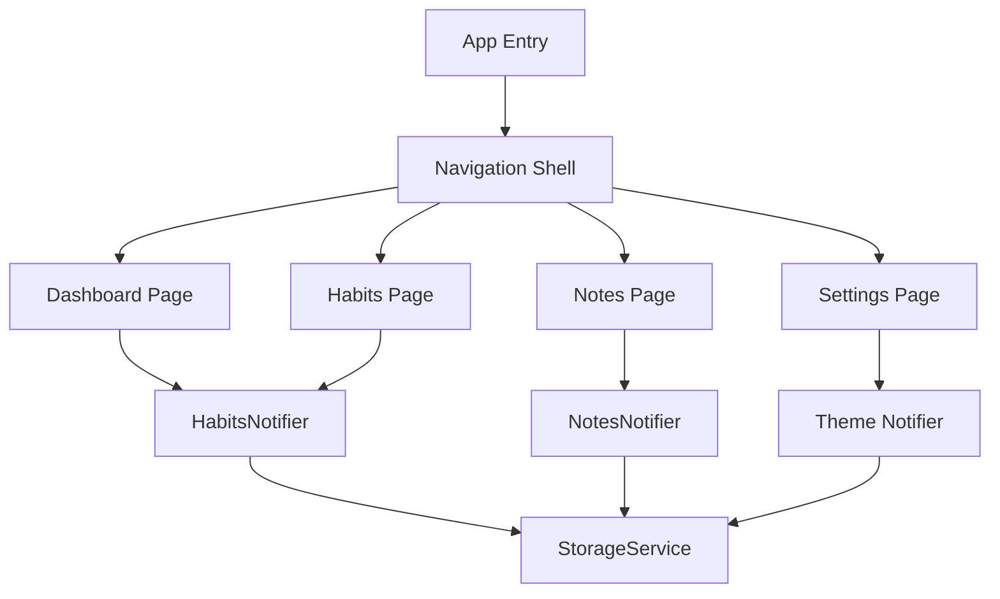

# Smart Habit Tracker

A cross-platform Flutter application for tracking your habits and taking rich notes.

## Features

- **Dashboard**: Two-column responsive layout for your active habits.
- **Neon Themes**: Beautiful custom themes with glowing borders, pulsing animations for unfinished daily habits, and custom ambient glows.
- **Notes**: Full rich-text editor with support for font sizes, scaling bullets, and real-time formatting.
- **Cross-Platform**: Built to run seamlessly on Windows, macOS, Linux, and Android.

## Prerequisites & Dependencies

To run this project, you will need:
- [Flutter SDK](https://docs.flutter.dev/get-started/install) (Ensure you have the latest stable version)
- Dart SDK (comes with Flutter)
- Android Studio or Xcode (for Android/macOS builds respectively)
- Visual Studio with C++ desktop development (for Windows builds)

## Getting Started

1. Clone the repository
2. Install dependencies:
   ```bash
   flutter pub get
   ```
3. Run the app:
   ```bash
   flutter run
   ```

### Quick Testing in Browser

For rapid prototyping and development without an emulator or desktop executable, you can quickly test the application in Chrome:
```bash
flutter run -d chrome
```

## Build Instructions (Exporting Executables)

### Windows
```bash
flutter build windows
```
*Output will be located at `build/windows/runner/Release/`*

### Android
```bash
flutter build apk
```
*Output will be located at `build/app/outputs/flutter-apk/app-release.apk`*

### macOS
```bash
flutter build macos
```
*Output will be located at `build/macos/Build/Products/Release/`*

### Linux
```bash
flutter build linux
```
*Output will be located at `build/linux/x64/release/bundle/`*

## Documentation

All architectural diagrams (Mermaid format) and detailed technical documentation should be placed in the `/docs` folder. See `/docs/ARCHITECTURE.md` for an example.

## Seed Database

For testing purposes, a Python script is included to generate a seed database populated with 5 sample habits (with randomized completions over the years) and 5 sample notes.

1. Navigate to the seed database directory:
   ```bash
   cd seed_database
   ```
2. Run the script:
   ```bash
   python generate_seed.py
   ```
   This will generate a `seed_data.json` file in the same directory.
3. Import the data into the app using the import feature on the Dashboard (or Settings) and select the `seed_data.json` file.

# Architecture

This document contains architectural diagrams and system explanations for the Smart Habit Tracker.

## Application Flow



## State Management

The application uses `provider` for state management, specifically exposing change notifiers for global states such as themes, notes, and habits.

